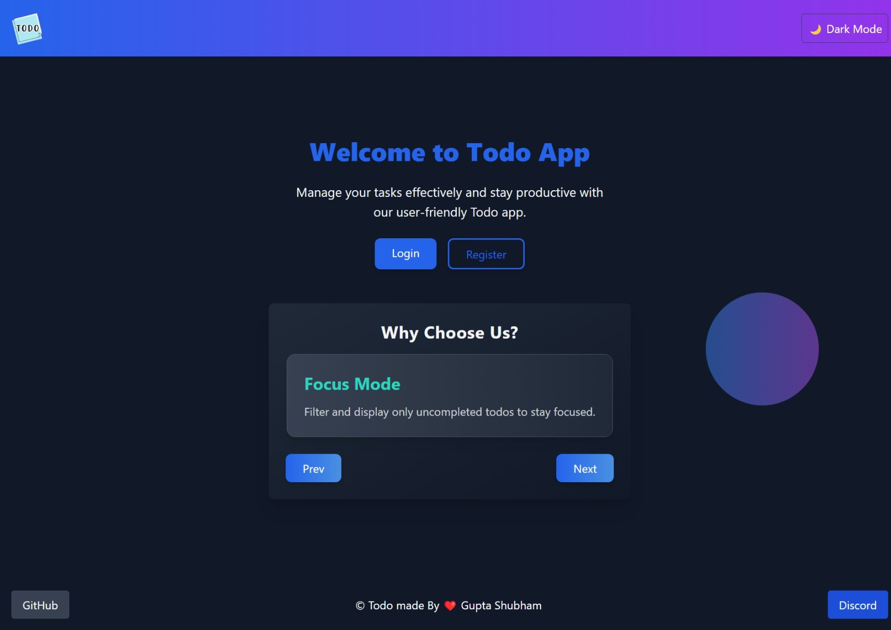
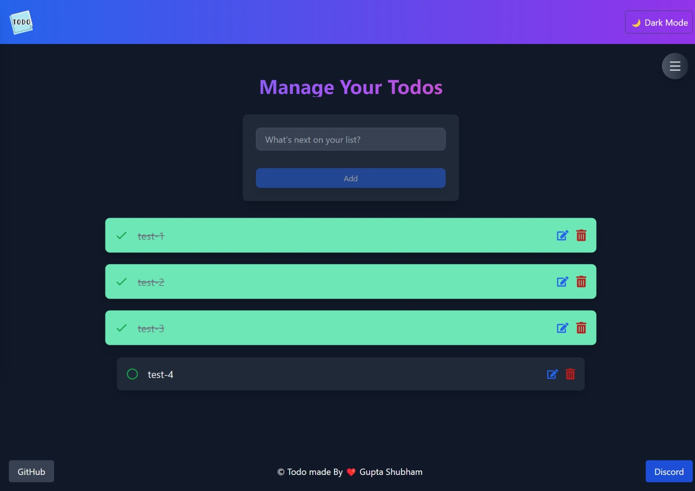
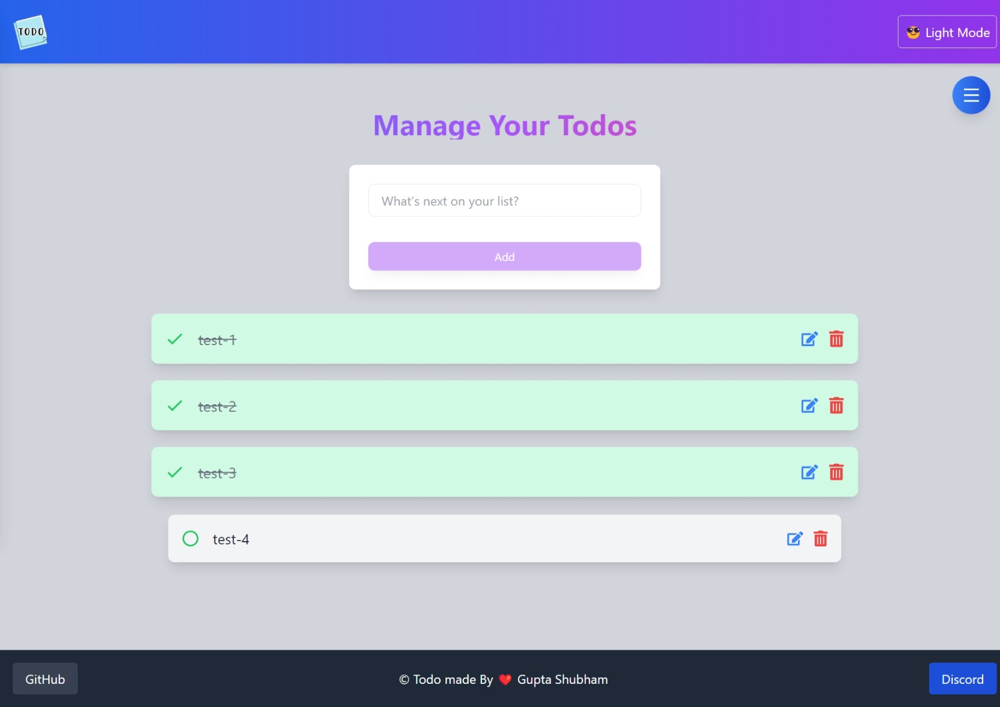
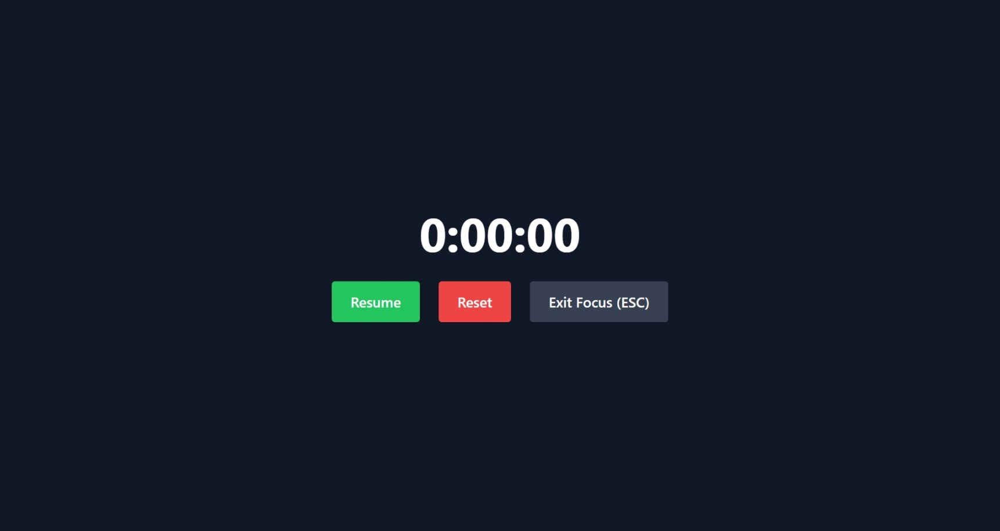
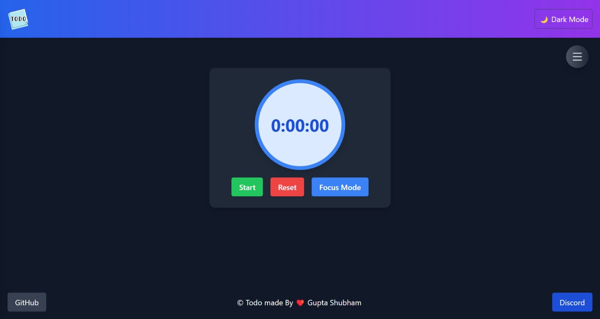
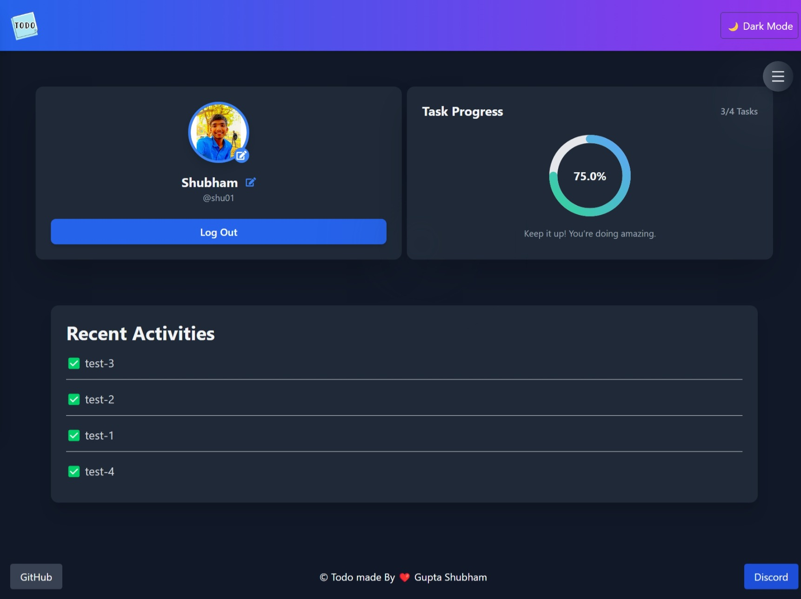
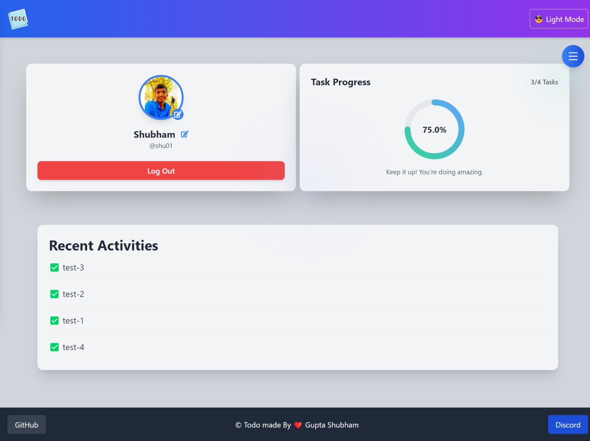
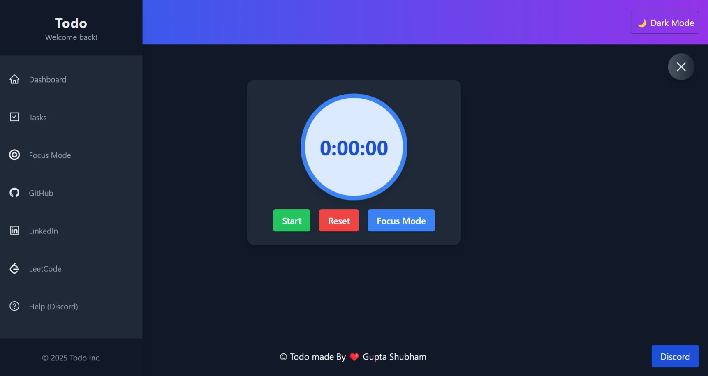

# 📝 Todo

## 🎉 Overview

**First project - never forgettable!**

This is a task management app built using **React** on the frontend and **Node.js** with **MongoDB** on the backend. Users can efficiently manage tasks, track progress, and monitor recent activities.



## ✨ Features

- **Add, Edit, Delete Todos** ➕ ✏️ ❌
  - Users can add new tasks, modify existing ones, and remove them.

- **Toggle Completion** ✅
  - Mark tasks as completed or incomplete with a simple click.

  
  

- **Focus Mode** 🎯
  - Filter uncompleted tasks to stay focused on pending work.

  

- **Timer** ⏳
  - Tracks elapsed time for each task and pauses when marked complete.

  

- **Dashboard** 📊
  - Displays task progress, completed todos, and activity overview.

  
  

- **Recent Activities** 🕒
  - Tracks recent completed and pending tasks.

- **Sidebar Navigation** 🧭
  - Quick access to various sections.

  

---

## 🛠 Technologies Used

### 🌐 Frontend
- ⚛️ **React** - UI Development
- 🎨 **Tailwind CSS** - Styling
- 🧩 **Redux** - State Management
- 🖼️ **React Icons** - UI Icons
- 📡 **Axios** - API Requests

### ⚙️ Backend
- 🌿 **Node.js** - Backend Logic
- 🚀 **Express.js** - API Handling
- 🗄️ **MongoDB** - Database
- 🔗 **Mongoose** - ODM for MongoDB

### 🔐 Authentication
- 🔑 **JWT (JSON Web Tokens)**

### 📦 Important Packages
- 🔒 **bcrypt** - Password Hashing
- 📤 **Multer** - File Uploads
- 🌍 **CORS** - Cross-Origin Requests

### ☁️ Hosting
- 🌐 **Vercel** - Frontend Hosting
- 📡 **Render** - Backend Hosting

---

## 🚀 Getting Started

### Prerequisites
- Install **Node.js**, **npm**, and **MongoDB**.

### Installation Steps

1. **Clone the repository:**
   ```bash
   git clone https://github.com/your-username/todo-app.git
   cd todo-app
   ```

2. **Install dependencies:**
   ```bash
   # Install backend dependencies
   cd server
   npm install

   # Install frontend dependencies
   cd ../client
   npm install
   ```

3. **Set up environment variables:**
   Create a `.env` file inside the `server` directory:
   ```bash
   MONGO_URI=your_mongodb_connection_string
   PORT=5000
   ```

4. **Run the application:**
   ```bash
   # Start backend server
   cd server
   npm start

   # Start frontend development server
   cd ../client
   npm run dev
   ```

5. **Open the app:**
   Visit `http://localhost:3000` in your browser.

---

## 🏗️ Project Structure

### 🖥️ Frontend
- `Todos.jsx` - Manages todo operations
- `Sidebar.jsx` - Navigation
- `Dashboard.jsx` - User statistics
- `Timer.jsx` - Time tracking component

### ⚙️ Backend
- `user.controller.js` - User authentication & management
- `todo.controller.js` - Todo operations
- `dashboard.controller.js` - Dashboard statistics

---

## 🤝 Contributing

Contributions are always welcome! Follow these steps:

1. **Fork the repository.**
2. **Create a new branch:**
   ```bash
   git checkout -b feature-branch
   ```
3. **Commit changes:**
   ```bash
   git commit -m "Added a new feature"
   ```
4. **Push to GitHub:**
   ```bash
   git push origin feature-branch
   ```
5. **Create a Pull Request.**

---


⭐ If you found this project helpful, consider giving it a star!
